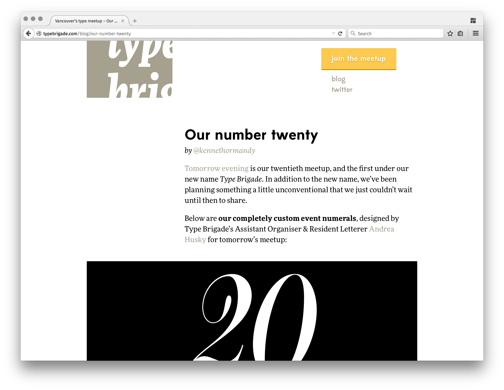

# Type Brigade

> I find, if you speak about anything for long enough, it always comes back to type.
> <br/>—Peter Cocking,<br/>&nbsp;&nbsp;&nbsp;&nbsp;_Designer_

[Type Brigade](http://typebrigade.com) is Vancouver’s type design and typography speaker series meetup.



## Running locally

If you’d like to run the website locally, you’ll need [Node.js installed](http://nodejs.org). Then, run the following commands on your terminal. If you’re unfamiliar with the terminal, take a look at [this helpful introduction](http://wiseheartdesign.com/articles/2010/11/12/the-designers-guide-to-the-osx-command-prompt/).

First, you’ll need to install [Node.js](http://nodejs.org), if you haven’t already. Then, you can install [Harp](http://harpjs.com), the static web server with built-in preprocessing. Harp is used to automatically compile all our Jade templates, Markdown blog posts, and Sass styles. It’s written using Node, but you don’t need to know anything about Node to use it. To install Harp itself, run the following command in your terminal:

```sh
# Install Harp
npm install --global harp
```

This will globally install the latest version of Harp using [npm](https://npmjs.org), the tool to install packages that came installed with Node. In some cases, you’ll need to preface this command with `sudo`:

```sh
# Alternatively, install Harp usin sudo
sudo npm install --global harp
```

You’ll need to enter your password, and the you’ll have the right user privledges to install Harp. You can also setup npm so [you don’t need to use `sudo`](https://docs.npmjs.com/getting-started/fixing-npm-permissions) and can skip this step for any future packages you install.

Next, you’re ready to run this site. Clone the repository using git. More instructions on this are [available from GitHub](https://help.github.com/articles/fork-a-repo/).

```
# Clone the repository
git clone https://github.com/typebrigade/typebrigade.com

# Move into the folder you just downloaded
cd typebrigade.com

# Install dependencies the project uses
npm install

# Serve the project with Harp
npm start
```

## Deploying

To deploy, you’ll need to have access to the project. Follow the [Running locally](#running-locally) instructions, and then:

```bash
# Deploy to staging
npm run stage

# Deploy to production
npm run deploy
```

## Licenses

Copyright © 2014–2015 [Type Brigade](http://typebrigade.com).

Code is available under [the MIT License (MIT)](LICENSE.md).

Blog posts, documents, graphic assets, speakers’ resources, etc. are copyright their respective owners unless otherwise specified.
