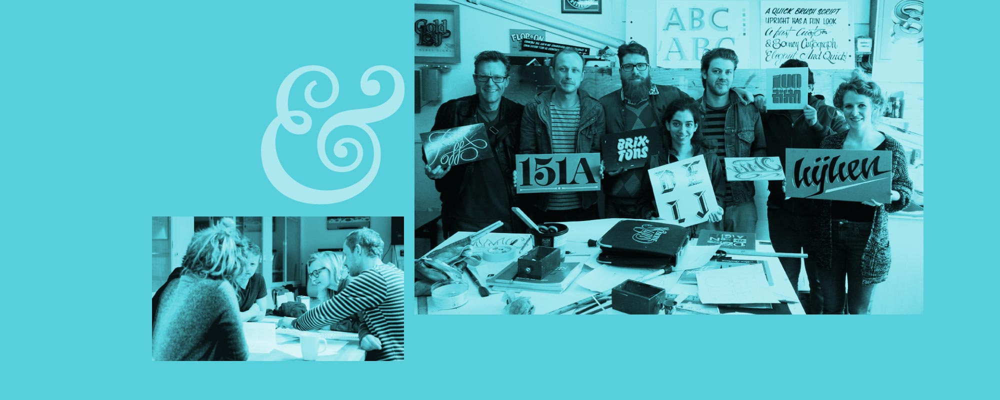

# Bruno Maag at Type Brigade

Bruno Maag, the London-based co-founder of the renowned type design studio [Dalton Maag](http://daltonmaag.com/) is traveling to speak at [a very special edition of Type Brigade](http://bruno-maag-talks-type.eventbrite.com/), March 26th at Emily Carr University of Art + Design.

The event is completely free to attend as long you [register soon](http://bruno-maag-talks-type.eventbrite.com/).

<figure class="figure figure--breakout">

<figcaption>Bruno Maag, left, and the Dalton Maag team.</figcaption>
</figure>

Type Brigade is [Vancouver’s type design and typography meetup](http://meetup.com/typebrigade), where we host speakers every other month.

## Bruno Maag Talks Type

Since 1991, Dalton Maag has worked closely with clients including BMW, Intel, Nokia, and many more to develop custom typefaces for complex situations. They are now one of the largest independent type design studios in Europe. They also publish a wide range of typefaces of their own, like [Effra](https://www.daltonmaag.com/library/effra), [Prometo](https://www.daltonmaag.com/library/prometo), and [Grueber](https://www.daltonmaag.com/library/grueber).

We are incredibly lucky to have Bruno Maag coming all the way from London to share his wealth of type, design, and business experience with us.

See you on March 26th for [Bruno Maag Talks Type](http://bruno-maag-talks-type.eventbrite.com/).
