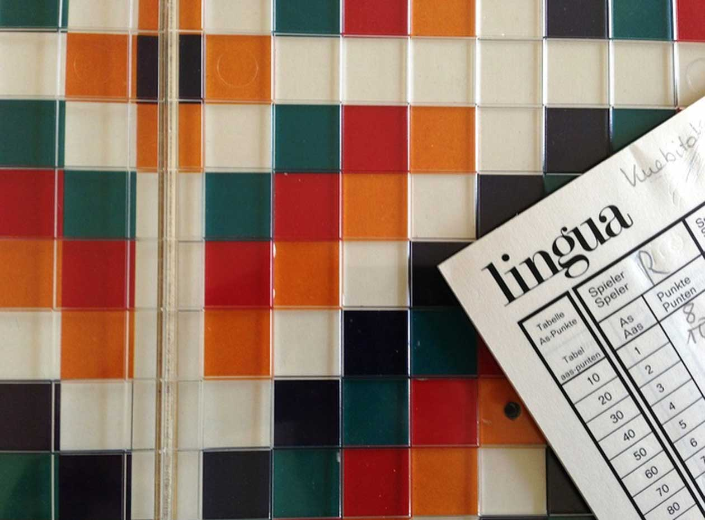
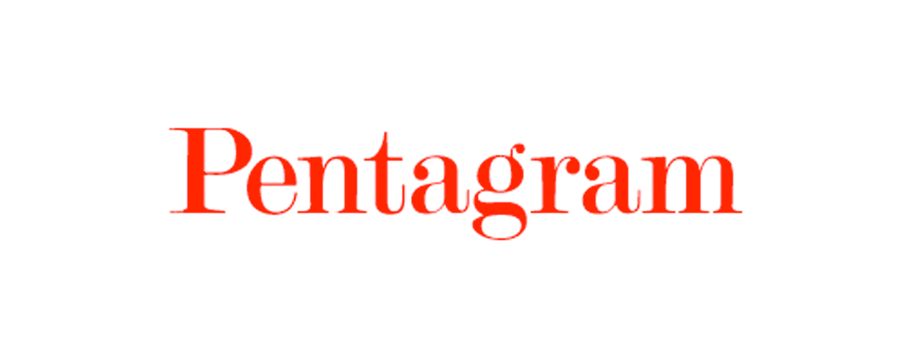
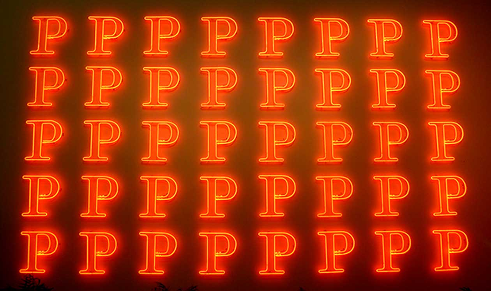
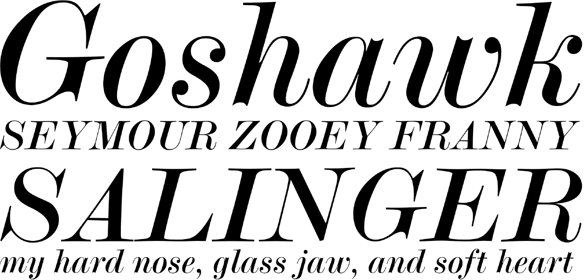
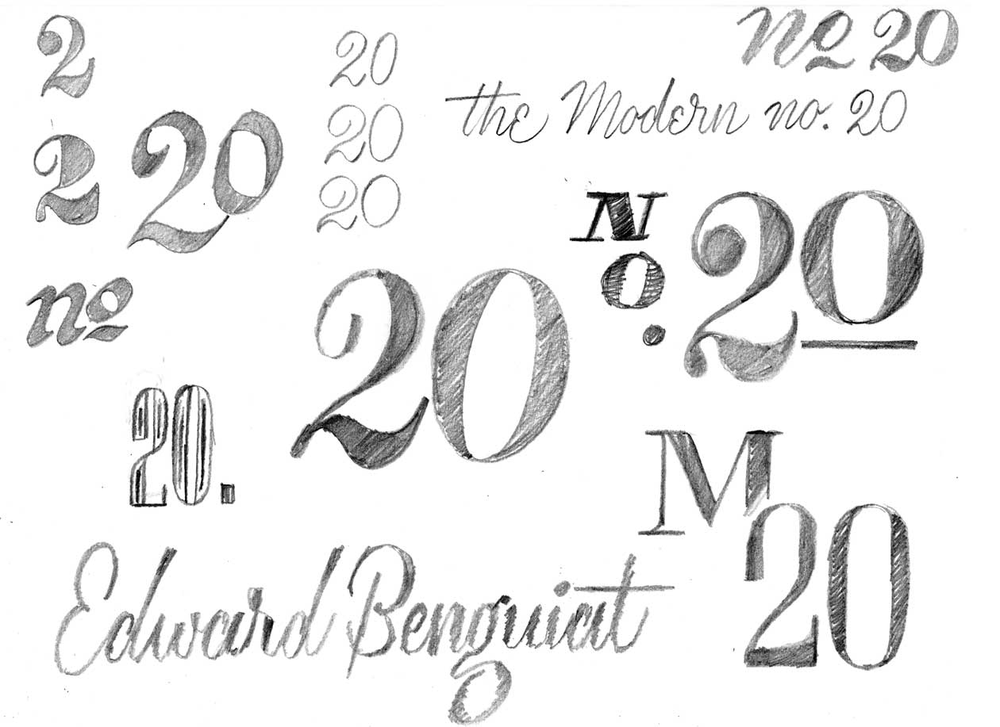

# Our number twenty

[Tomorrow evening](http://www.meetup.com/typebrigade/events/186884552/) is our twentieth meetup, and the first under our new name _Type Brigade_. In addition to the new name, we’ve been planning something  a little unconventional that we just couldn’t wait until then to share.

Below are __our completely custom event numerals__, designed by Type Brigade’s Assistant Organiser & Resident Letterer [Andrea Husky](http://instagram.com/andreahusky) for tomorrow’s meetup:

<figure class="figure--breakout">

<figcaption>
The Type Brigade №20 event numerals, designed by our own [Andrea Husky](http://instagram.com/andreahusky).
</figcaption>
</figure>

Andrea is cleverly referencing [Modern №20](http://fontsinuse.com/typefaces/298/modern-no-20) by [Ed Benguiat](http://typedia.com/explore/designer/ed-benguiat/) for Type Brigade №20, and the result is these fantastic Didone numerals we’re proud to call our own.

Modern №20 has certainly been used in [a wide range of places](http://fontsinuse.com/typefaces/298/modern-no-20), from the cover of a 70s board game to the visual identity the largest independent design consultancy in the world.

<figure>

<figcaption>
Lingua board game, [<abbr>CC BY-NC-SA 3.0</abbr>](http://creativecommons.org/licenses/by-nc-sa/3.0/) [Board Game Geek](http://boardgamegeek.com/boardgame/5174/lingua) via [Stephen Coles of Fonts in Use](http://fontsinuse.com/uses/2269/lingua).
</figcaption>
</figure>

<figure class="figure--border">

<figcaption>
The Pentagram wordmark
</figcaption>
</figure>

<figure class="figure--border">

<figcaption>
A piece from the [<cite>Pentagram Remixed</cite>](http://new.pentagram.com/2013/06/pentagram-remixed-opens-at-ningbo-design-biennial/) exhibition.
</figcaption>
</figure>

When asked about Pentagram’s visual identity, Michael Bierut offered a simple history:

> just the name written in the typeface Modern №20. The original five partners used the typeface in the book they published in 1972 when the firm was founded, and I think it was simply adopted as the standard way of writing the name thereafter.

> __Michael Bierut, [Our Own Worst Clients](http://www.underconsideration.com/speakup/archives/001946.html)__

The italic, less commonly used in identity work than the roman, has been captured in FontShop’s specimens:

<figure class="figure--breakout">

<figcaption>
A portion of [FontShop’s specimen](http://www.fontshop.com/fonts/downloads/bitstream/modern_no_20_std_italic/) for Modern №20
</figcaption>
</figure>

Andrea shared some of her process from the numerals, too. You should [follow her on Instagram](http://instagram.com/andreahusky) to see more of her fantastic lettering in progress.

<figure class="figure--border">

<figcaption>
Some of Andrea’s sketches
</figcaption>
</figure>

Type Brigade’s [team](../about) and I are hoping to make this meetup unique, and type history and our event numerals are going to be a big part of that.

## See you tomorrow

If you’re already registered for __tomorrow’s [Type Brigade №20](http://www.meetup.com/typebrigade/events/186884552/)__, we can’t wait to see you. The event is at [Mobify HQ, on the 3rd Floor of 948 Homer Street](https://www.google.com/maps/place/948+Homer+St/@49.2780571,-123.119061,17z). Doors open around 6:30PM with the event starting at 7:00.

If you are registered but can no longer make it, please update your RSVP for [this event](http://www.meetup.com/typebrigade/events/186884552/) so those on the waitlist can get a spot.

If you’re on the waitlist, mention [@typebrigade](http://twitter.com/typebrigade) at any time and we’ll confirm that there’s space for you as quickly as we can.

See you at Type Brigade!