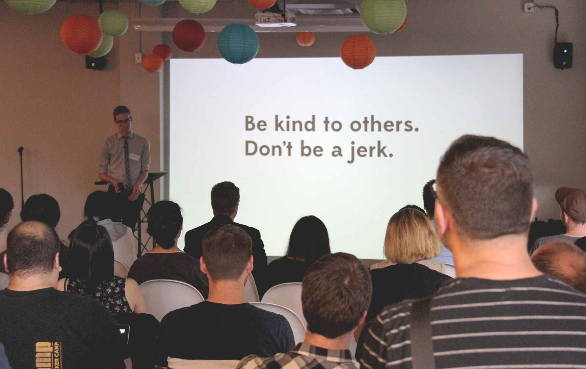

# Why we relaunched with a Code of Conduct

“It was great hanging out with everyone, and I learned a lot too!”

This is probably what organisers hope to hear as you leave their design, development, technology, music, or other meetup in here in Vancouver. And it is the experience that many of us have—but not everyone. __It’s worthwhile defining those expectation__, with the goal of making sure every attendee has a positive experience.

## A commitment

We want to make sure Type Brigade, Vancouver’s type design and typography meetup, is a welcoming environment. We also want to clearly make a stance against the harassment which is [all too common](http://adainitiative.org/what-we-do/conference-policies/) at tech and tangentially related conferences and events.

We shared our commitment to that through our [Code of Conduct](/code-of-conduct), announced at our first event last week. It’s almost entirely based on the work of peers we admire.

<figure>

<figcaption>Introducing the Code of Conduct at Type Brigade №20</figcaption>
</figure>

## Learning from our peers

[Type Brigade’s Code of Conduct](../code-of-conduct) is heavily based on the work of many meetups and conferences before us, but I’m especially thankful to [Tracy Abrams](https://twitter.com/hackygolucky) for working on  [CascadiaJS](http://cascadiajs.com) and [PDXNode](http://www.meetup.com/pdxnode) in the open. This gave us a jumping-off point, and helping making the value of a Code of Conduct clear.

Building on our peers’ work, Type Brigade’s Code of Conduct is summarised as __“Be kind to others, don’t be a jerk”__. The [full version](../code-of-conduct) explicitly outlines expectations for attendees, speakers, and organisers of Type Brigade.

## Meetups are growing up

The current class of Vancovuer meetups are rapidly growing in size, and the way we’re running them should mature accordingly.

My co-workers and friends at [Chloi](http://chloi.io) run Type Brigade’s sibling meetups; __[CSS Brigade](http://cssbrigade.com)__ recently reached their 500th member on its 1 year anniversary, and __[Node Brigade](http://meetup.com/node-brigade-vancouver)__ is now at 400 members.

__[Style & Class](http://www.meetup.com/styleandclass)__ clearly tapped into something special, too. Their upcoming meetup has over 180 people hoping to attend—understandable after the last event, where [Mozilla’s Stephanie Hobson](https://twitter.com/stephaniehobson) and [Steve Mynett of Hootsuite](https://twitter.com/SteveMynett) both gave seriously impressive, conference-quality talks.

<figure class="figure-aside figure-breakout">

<figcaption>
Stephanie delivers her presentation on accessibility at Style & Class, hosted by HootSuite.
</figcaption>
</figure>

My friends at [Brewhouse](http://brewhouse.io) run up to three __[#vanruby](http://vanruby.com)__ events a month for over 1,100 members! On the other end of the spectrum, meetups like __[HxDVacouver](http://www.meetup.com/HXD-Vancouver/)__ are much smaller but still run every month.

When there’s a monthly meetup for health design, and a typography meetup with a waitlist, there’s clearly sustainable interest in seemingly niche subjects.

## Sponsors can help, too

Some frequent Vancouver meetup venues have new legal requirement when hosting people in their space, which is understandable: they are taking on a lot of responsibility.

For some companies, a Code of Conduct likely aligns with the values the company would like their sponsorship to uphold anyway. For some forward-thinking companies like [Heroku](https://blog.heroku.com/archives/2013/12/11/code_of_conduct) or MailChimp, a Code of Conduct is part of their sponsorship application process:

> we try to help out with great ideas that align with our values. … If you’d like to tell us about your event, please also consider pointing us to your code of conduct. It’s important.

I’d be happy to see local meetup sponsors make similar requests.

## How we share our time together

Ultimately, these are professional events. These standards should help define most people’s existing expectations, and are one way we hope to mitigate potential issues.

The Vancouver Typography Meetup Group saw a wide range of people attend before me, and I hope it also welcomes a whole new group of people as well as Type Brigade. Meetups might not be able to fit every single member in every event, but we do want every member and  attendee to feel welcome.

### Editable, reusable

I’d like to see other meetups to adopt a Code of Conduct, or modify Type Brigade’s to suit their needs.

Type Brigade’s Code of Conduct is licensed under [Creative Commons](http://creativecommons.org/licenses/by/3.0/), and is ready for [proposed edits and improvements](https://github.com/typebrigade/typebrigade.com/edit/master/code-of-conduct.md) by our community.

## Community defined

So far, our Code of Conduct is largely based on the [PyCon Code of Conduct](https://us.pycon.org/2012/codeofconduct/) and the [PDXNode code of Conduct](https://github.com/PDXNode/pdxnode/blob/master/code-of-conduct.md#code-of-conduct), but [it’s also editable and maintained](https://github.com/typebrigade/typebrigade.com/edit/master/code-of-conduct.md) by our community. You’ll need a [GitHub account](https://github.com/typebrigade/typebrigade.com/edit/master/code-of-conduct.md) to make changes, but we’re hoping to change or document this better so it’s easy for anyone interested in helping.

### Tell us what you think

If you have any comments or concerns about it, you can email me any time at [kenneth@typebrigade.com](mailto:kenneth@typebrigade.com) or [@kennethormandy](http://twitter.com/kennethormandy).

During events, you can also contact myself and our Assistant Organiser Assistant Organiser through Type Brigade’s phone number: 778 722 1587.

## Additional resources

- [List of Codes of Conduct examples](http://indiewebcamp.com/code-of-conduct-examples)
- PDXNode’s Code of Conduct 
- CascadiaJS’ Code of Conduct
- [JS Conf introduces their Code of Conduct](http://2012.jsconf.us/#/about)
- Our [Type Brigade Handbook](http://github.com/typebrigade/handbook) is in the very early stages, and will hopefully be replaced with a collaboration between a group of meetups instead