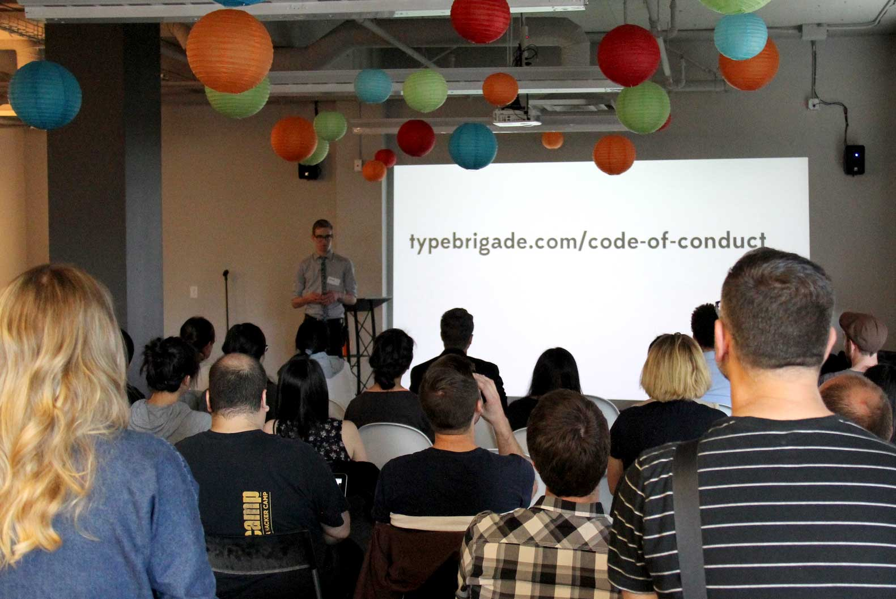
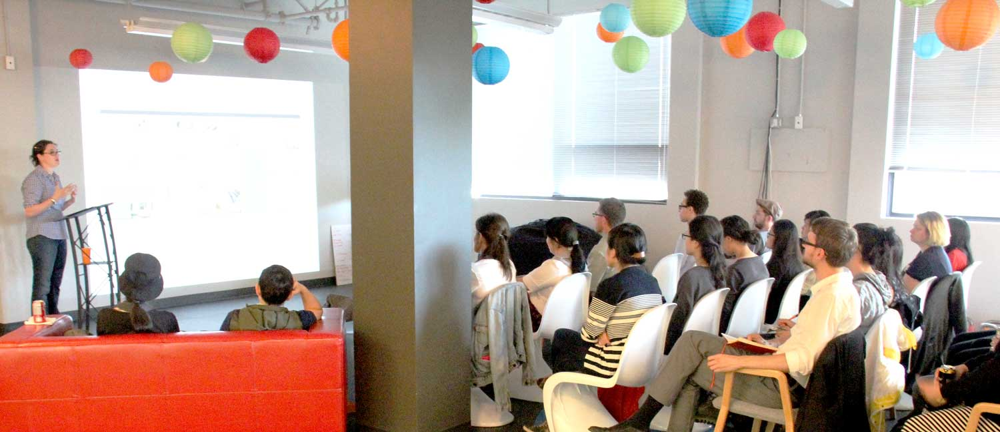
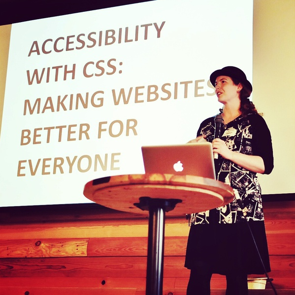

# Why we adopted a Code of&nbsp;Conduct

When we re-launched Vancouver’s typography and type design meetup as Type Brigade, we adopted a Code of Conduct. Your meetup can too.

## On expectations

“It was great hanging out with everyone, and I learned a lot too!”

This is how many attendees expect to feel when they leave a design, development, technology, or art meetup here in Vancouver. It’s a reaction organisers are hoping for, too. And it is the experience that many of us have—but not everyone.

It’s worthwhile __explicitly defining these community expectations__. This is why Type Brigade, Vancouver’s type design and typography meetup, adopted [a Code of Conduct](http://typebrigade.com/code-of-conduct) for our first event under our new name last month.

<figure>

<figcaption>Introducing the Code of Conduct at Type Brigade №20. [Photo CC BY 2.0 Stephen Bau.](https://www.flickr.com/photos/bauhouse/14527580863/in/set-72157645407658123)</figcaption>
</figure>

It’s a commitment to welcoming potential participants and all attendees, creating a positive, professional experience at our events, and take a clear stance against harassment which is [all too common](http://adainitiative.org/what-we-do/conference-policies/) at technology and related conferences.

## Our Code of Conduct

Type Brigade’s Code of Conduct is summarised as __“Be kind to others, don’t be a jerk”__. The [full version](http://typebrigade.com/code-of-conduct) explicitly outlines expectations for attendees, speakers, organisers, and sponsor representatives at Type Brigade.

### …is not “our” Code of Conduct

We’re far from the first meetup to adopt a code like this, and I am very, very far from being an expert on this subject.

That’s why [Type Brigade’s Code of Conduct](http://typebrigade.com/code-of-conduct) is entirely based on the work of many meetups and conferences before us. I’m especially thankful to [Tracy](https://twitter.com/hackygolucky) for working on  [CascadiaJS](http://cascadiajs.com) and [PDXNode](http://www.meetup.com/pdxnode) in the open. This gave us a jumping-off point, and helped make the value of a Code of Conduct clear.

We’d rather Type Brigade wasn’t notable for adopting a Code of Conduct, and hope other meetups that we look up to follow suit.

## Why adopt one now?

The current class of Vancovuer meetups are rapidly growing in size, which brings new opportunities to help communicate what we’d like to see happening in our wider community, beyond the subject of the meetup itself.

<figure class="figure--breakout">

<figcaption>Celeste Martin at Type Brigade №20. [Photo CC BY 2.0 Stephen Bau.](https://www.flickr.com/photos/bauhouse/14527580863/in/set-72157645407658123)</figcaption>
</figure>

This is especially true as many meetups see as many first-timers as regulars. Student attendees—including me—and recent grads are increasingly common, from [Kwantlen](http://www.kpu.ca/), [Langara](http://www.langara.bc.ca/), [Emily Carr](http://ecuad.ca/), [CodeCore](http://codecore.ca/), [Lighthouse Labs](http://www.lighthouselabs.ca/), [SFU](http://www.sfu.ca/), [UBC](http://www.ubc.ca/), [Capilano](http://www.capilanou.ca/), [BCIT](http://www.bcit.ca), and more.

Attendees without formal training are equally qualified and welcome at our events, and creating a welcoming environment for them is important, too.

Meetups larger and smaller than Type Brigade have the opportunity to share their values through a Code of Conduct, and help define the community we wish it was now.

### Meetups we look up to

My co-workers and friends through [Chloi](http://chloi.io) run Type Brigade’s sibling meetups, where __[Node Brigade](http://meetup.com/node-brigade-vancouver)__ has 400 members, and __[CSS Brigade](http://cssbrigade.com)__ surpassed 500 in one year.

__[Style & Class](http://www.meetup.com/styleandclass)__ have clearly tapped into something special, too. Recent events had over 180 people hoping to attend—understandable after a prior event, where [Stephanie Hobson](https://twitter.com/stephaniehobson), now of Mozilla, and [Steve Mynett of Hootsuite](https://twitter.com/SteveMynett) both gave seriously impressive, conference-quality talks.

<figure>

<figcaption>
Stephanie presents on the value of making the web for everyone, at Style & Class. [Photo by Steve Fisher](http://www.meetup.com/styleandclass/photos/21879542/#363398412)
</figcaption>
</figure>

Somehow, our friends at [Brewhouse](http://brewhouse.io) run up to three __[#vanruby](http://vanruby.org)__ events a month for over 1,100 members! [Steamclock](http://www.steamclock.com/) accomplishes similar feats through  __[VanCocoa](http://www.vancocoa.com/)__ and __[VanJS](http://www.meetup.com/vancouver-javascript-developers/)__. Expanding beyond specific languages or technologies, the __[HxD Vacouver](http://www.meetup.com/HXD-Vancouver/)__ runs every month, too.

From HTML5 to health design, there’s clearly sustainable interest in these meetups across a very wide range of subjects.

We can make a further impact across these events through a Code of Conduct, making it known that we continuing to try and get better at welcoming people, and that exclusionary behaviour or harassment will not be tolerated.

### Sponsoring values

As part of this maturation, some Vancouver meetup venues have new legal requirements we need to meet when hosting events in their space. This is completely understandable: they are taking on a lot of responsibility.

A Code of Conduct is a conceivable extension of these requirements. Outside of Vancouver, some companies like [Heroku](https://blog.heroku.com/archives/2013/12/11/code_of_conduct) or MailChimp have made submitting their Code of Conduct part of the sponsorship application process:

> we try to help out with great ideas that align with our values. … If you’d like to tell us about your event, please also consider pointing us to your code of conduct. It’s important.
> __MailChimp__

I’d be happy to see local meetup sponsors and venues make similar requests.

## Improve how we meet up

Ultimately, these meetups are professional events. A Code of Conduct is one way to help mitigate issues, define expectations, and communicate that, “Yes, you are welcome here.”

I’d like to see other meetups to adopt a Code of Conduct between now and their next event.

I will continue to share our Code of Conduct at the beginning of every Type Brigade. If you’d like to do the same at your meetup or one you attend, borrow from the liberally licensed resources below—that’s what we did—or send me an email at [kenneth@typebrigade.com](mailto:kenneth@typebrigade.com) anytime.

## Adopt a Code of Conduct

- [List of Codes of Conduct examples](http://indiewebcamp.com/code-of-conduct-examples)
- [JS Conf introduces their Code of Conduct](http://2012.jsconf.us/#/about) in 2012
- The [Conference Code of Conduct](http://confcodeofconduct.com/), which informed…
- [PDXNode’s Code of Conduct](https://github.com/PDXNode/pdxnode/blob/master/code-of-conduct.md)
- [CascadiaJS’ Code of Conduct](http://2014.cascadiajs.com/code-of-conduct.html)
- [Type Brigade’s Code of Conduct](http://typebrigade.com/code-of-conduct)

<small>Thanks to [Jorge Pedret](https://twitter.com/jorgepedret), [Claire Atken](https://twitter.com/claire_atkin), [Cheryl Li](https://twitter.com/cherylhjli), and [Chuck Bergeron](https://twitter.com/chuckbergeron) for reviewing this post, and to everyone contributing to the resources we’re learning&nbsp;from.</small>
