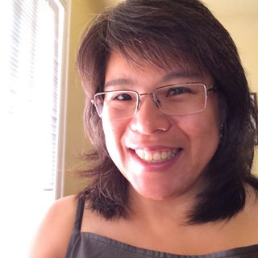

# About Type Brigade

Type Brigade is Vancouver’s type speaker series. Every other month, we host two talks: one on typography, and one on type design.

## Contact

Email [kenneth@typebrigade.com](mailto:kenneth@typebrigade.com) 
Tweet [@typebrigade](http://twitter.com/typebrigade) 

## Contributors

All contributors and speakers hope to bring the type and design community in Vancouver a little closer together.

- ### Kenneth Ormandy

  

  _Organiser_

  Kenneth is an independent designer and front-end web developer.

  [kennethormandy.com](http://kennethormandy.com)

- ### Cody Jones

  

  _Organiser_

  Cody is a freelance designer and fledgling type designer, helping technology get along with people.

  [mediumjones.com](http://mediumjones.com)

- ### Alanna Munro

  

  _Assistant Organiser, Lettering_

  Alanna is a freelance interaction designer, typographer, letter-maker and code explorer.

  [alannamunro.com](http://alannamunro.com)

- ### Nancy Wu

  

  _Assistant Organiser_

  Nancy Wu is a graphic designer specializing in brand identity, idea generation and art direction.

  [nancywudesign.com](http://nancywudesign.com/)

- ### Andrea Husky

  

  _Lettering_

  Andrea likes letters. A lot. She is currently a graphic designer for Herschel.

  [andreahusky.com](http://andreahusky.com)

- ### Riley Cran

  

  _Lettering_

  Riley is a designer based in the Pacific Northwest, with a specialty in identity, packaging and illustration.

  [rileycran.com](http://rileycran.com)

***

## Alumni

- ### Shelley Gruendler

  

  _Founder_

  Dr. Shelley Gruendler founded the Vancouver Typography Meetup Group, and was its original organiser. She’s a typographer, designer, and educator, in addition to being the founding director of [Type Camp](http://typecamp.org).

<!--

Need to turn this into something more maintainable

## Thanks

- ### Ross Milne

  

  _Special Events_

  [workingformat.com](http://workingformat.com)

  - Diane Huynh

-->
