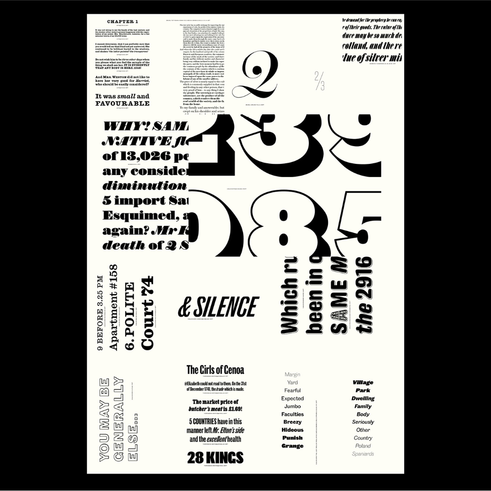
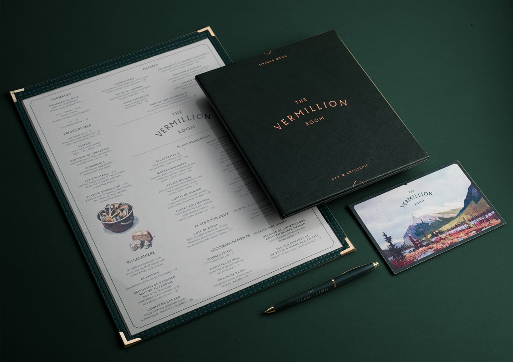
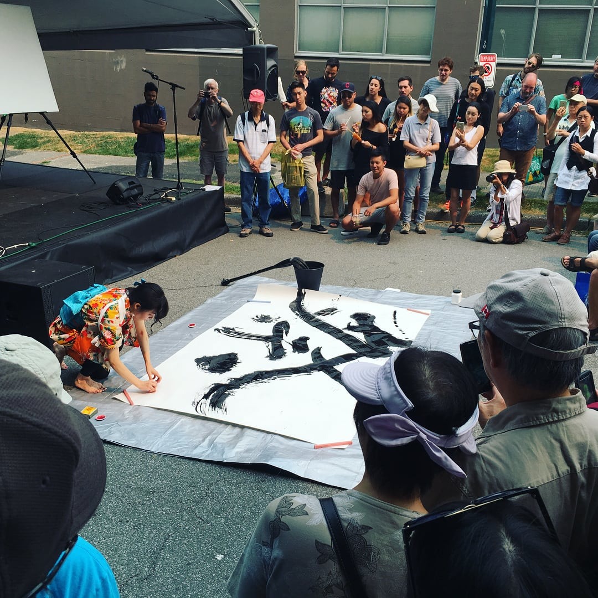

import Schedule from "../components/Schedule"

# Type Brigade №50

On March 30, 2020, we’re hosting a special event one-day Type Brigade event! This lines up with Type Brigade №50, and celebrates our 5th year as a speaker series.

This is the only event we’re planning for 2020, so we hope to see you there.

You’ll see six of incredible speakers delivering new talks, with more surprises to come.

<tito-widget event="typebrigade/50"></tito-widget>

## Schedule

<Schedule />

## Keynote

**Paul Barnes** 
[Commercial Type](https://commercialtype.com/) and [Commercial Classics](https://commercialclassics.com/) 
London, UK

Paul Barnes is a British graphic designer, type designer, and founding partner with Christian Schwartz in the London and New York based foundry [Commercial Type](https://commercialtype.com/). Over the last ten years with Schwartz and individually he has designed a number of acclaimed custom and retail faces, from the enormous editorial Guardian family through to the more experimental such as Dala Floda and Marian. He has a particular interest in the history of letterforms, which has led to Commercial Type’s new venture Commercial Classics an exploration of reviving long forgotten and extinct typefaces.

## Speakers

**Phoebe Glasfurd** 
Creative Director and co-founder of [Glasfurd & Walker](http://glasfurdandwalker.com/) 

**Kisyuu** 
[Japanese Calligraphy](http://kisyuu-calligraphy.com/) performance and talk

**To be announced** 
More speaker announcements and details to come!

**To be announced!** 
More speaker announcements and details to come!

Thanks for being part of Type Brigade over these last 5 years, however long it’s been for you, and we hope to see you at this special event.
