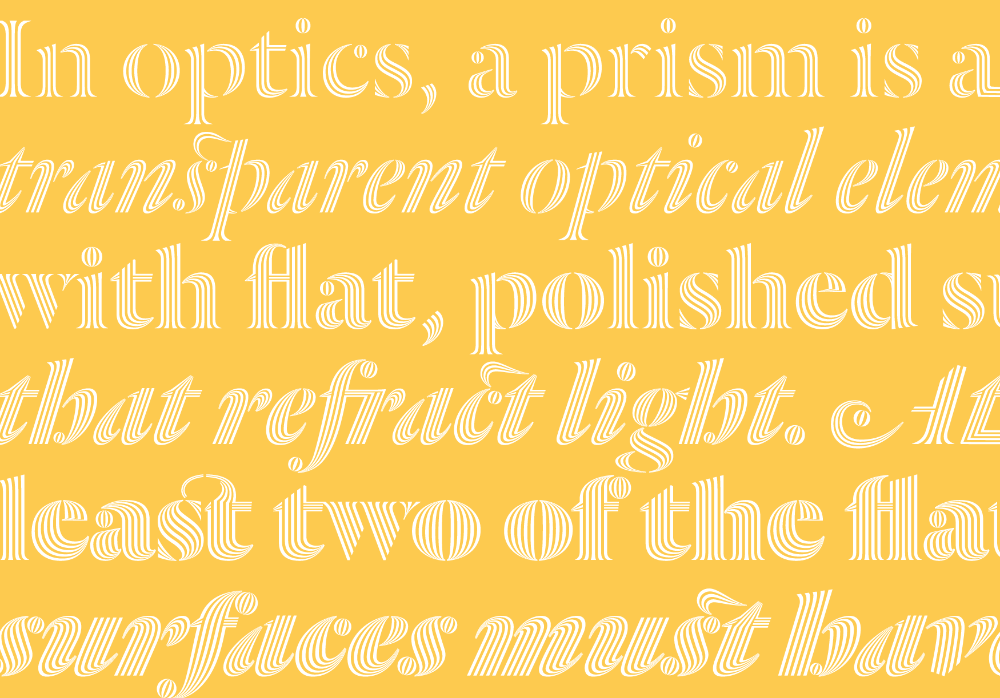

[Commercial Type](https://commercialtype.com/), the highly respected type design studio based in London and New York, are touring North America this fall. On September 1st, 2015, Vancouver will be their first stop for [a very special Type Brigade!](http://www.meetup.com/typebrigade/events/224125426/)

Type Brigade is [Vancouver’s type design and typography meetup](http://meetup.com/typebrigade), where we host speakers every other month. The event is completely **free to attend** as long as you [register soon](http://www.meetup.com/typebrigade/events/224125426/).

Commercial Type was formed by designers Paul Barnes and Christian Schwartz. They have been collaborating since 2004 on various
projects, including the award winning [Guardian family](http://showcase.commercialtype.com/guardian).

<figure class="figure--aside figure--breakout">
  
<figcaption>

<cite>Dala Prisma</cite> 
Designed by Paul Barnes & 
Ben Kiel, 2014

</figcaption>
</figure>

The talk is about their past five years as Commercial Type:

> ## It’s not just about the money, it’s not just about the art.

> For the past five years Paul Barnes and Christian Schwartz have been running one of the most exciting and influential type foundries, [Commercial Type](https://commercialtype.com/), with offices in New York and London. They have managed to create both popular and critically acclaimed typefaces for a diverse range of organisations, from the Guardian Newspaper, Vanity Fair magazine, to shirt numbers for Puma at the <abbr class="caps">FIFA</abbr> 2010 World Cup. Their designs vary from the utilitarian [Graphik](https://commercialtype.com/typefaces/graphik) and [Stag](https://commercialtype.com/typefaces/stag), through to the playful and expressive [Dala Floda](https://commercialtype.com/typefaces/dala_floda) and [Marian](https://commercialtype.com/typefaces/marian). They will talk about the processes behind their designs, balancing the needs for expression, self expression and functionalism.

## Location

This Type Brigade Special is sponsored by [CodeCore](http://codecore.ca/), who is kindly sharing their space for the event:

<address>
<a href="https://www.google.ca/maps/place/142+W+Hastings+St,+Vancouver,+BC+V6B/@49.2821585,-123.1086794,17z/data=!3m1!4b1!4m2!3m1!1s0x5486717984d4ef63:0x695af2b5a31aca7b?hl=en">
142 W Hastings St. 
Vancouver, <abbr class="caps">BC</abbr>
</a>
</address>

## Sponsors?

We have some extra sponsorship slots open right now, if you’re interested in helping make Type Brigade even better. [More details are here.](/sponsors)

Special thanks to our increasingly frequent collaborator [Ross Milne](https://twitter.com/sincerelyross), for helping to bring this event to Vancouver.
